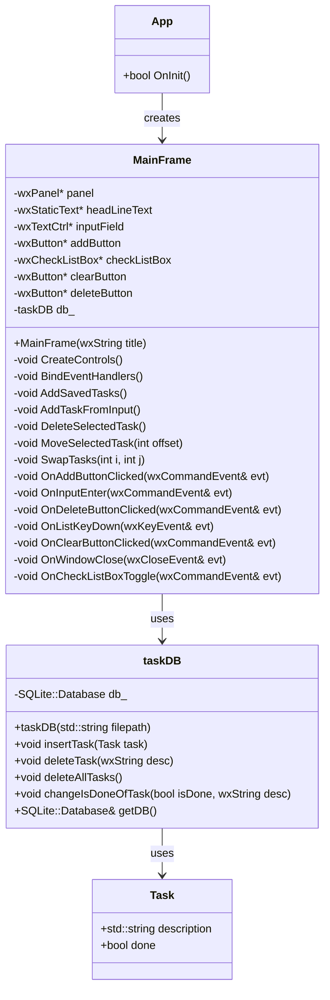

## 📝 Storing Tasks Data in a SQLite3 Database

This project is a To-Do List application built with C++ and wxWidgets that allows users to create, manage, and persistently store their tasks. It integrates SQLite3 as a lightweight relational database to ensure tasks are saved across sessions. The application's user interface is intuitive, and designed with simplicity in mind.

## 📦 Technologies Used

C++17

wxWidgets (GUI Framework)

SQLite3 (via SQLiteCpp wrapper)

Standard C++ STL (for data handling and file I/O)

## 🧠 Features

Add, delete, and mark tasks as complete/incomplete.

Keyboard shortcuts for task management.

Persistent storage via SQLite.

Confirmation dialog for clearing all tasks.

Data saved to file on close for redundancy.

## ✅ Compile and run the Project

```shell
mkdir build
cd build
cmake ..
make -j8
```

## 🔍 How to Access the Database

```shell
cd build
sqlite3 tasks.db
```

## 🗄️ Database

