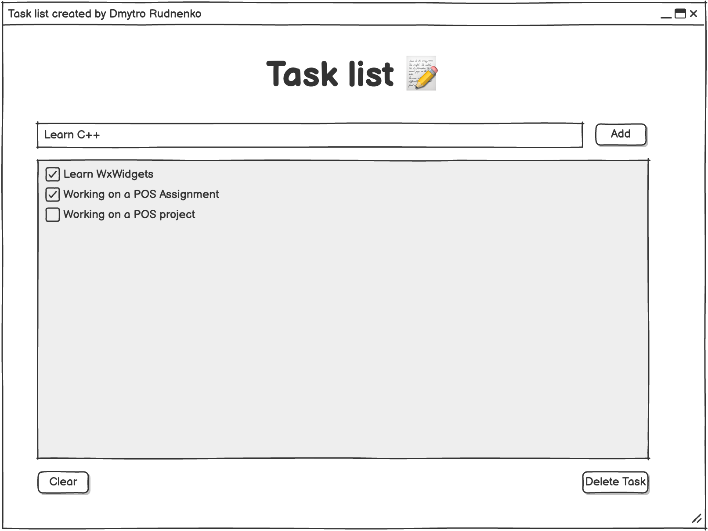
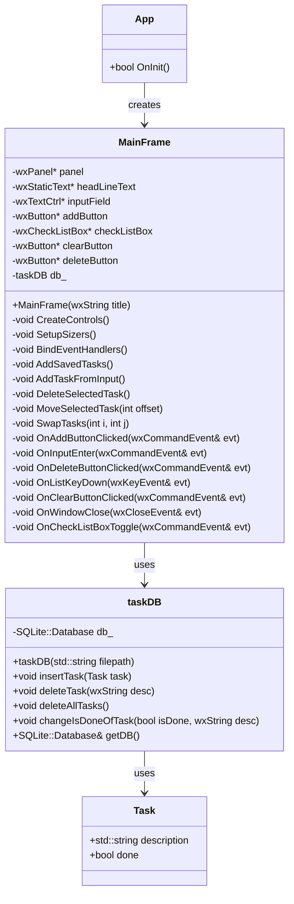

## 📝 Storing Tasks Data in a SQLite3 Database

This project is a To-Do List application built with C++ and wxWidgets that allows users to create, manage, and persistently store their tasks. It integrates SQLite3 as a lightweight relational database to ensure tasks are saved across sessions. The application's user interface is intuitive, and designed with simplicity in mind. The application automatically adapts to all devices.

## Setup
Install the required dependencies:
```shell
sudo apt install sqlite3
```

## 🎨 Wireframe
To help visualize the application's design and user flow, a detailed wireframe of the project has been created. It provides a clear overview of the UI layout and interaction, serving as a blueprint for development and future improvements.

You can also explore the interactive wireframe online here:
[Look wireframe on Balsamiq](https://balsamiq.cloud/sblk1qe/p9m28kw/r6B84)

## 📦 Technologies Used

C++17

wxWidgets (GUI Framework)

SQLite3 (via SQLiteCpp wrapper)

Standard C++ STL (for data handling and file I/O)

Catch2 (for unit testing)

## 🧠 Features

Add, delete, and mark tasks as complete/incomplete.

Automatic adaptation

Keyboard shortcuts for task management.

Persistent storage via SQLite.

Confirmation dialog for clearing all tasks.

Data saved to file on close for redundancy.

## ✅ Compile and run the Project

```shell
mkdir build
cd build
cmake ..
make -j8
./todo_list
```

## 🔍 How to Access the Database

```shell
cd build
sqlite3 tasks.db
```

## 🧪 Test Coverage
The project includes unit tests using Catch2 to ensure reliability and correctness of core functionality. Tests are written for:

Adding tasks

Deleting a single task

Changing task completion status

Deleting all tasks

Database persistence and structure

To run the test cases:

```shell
cd build
./database_tests 
```

## 🔄 Overview of the Structure

